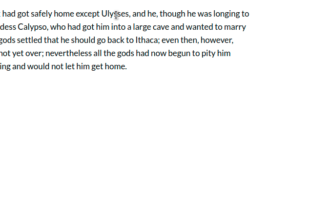

# Recogito Semantic Tags Widget

A generic semantic tagging widget for [RecogitoJS](https://github.com/recogito/recogito-js) 
and [Annotorious](https://github.com/recogito/annotorious). Can also be imported and used
as a normal React component (similar to a standard multi-select dropdown). Live demo
[here](https://recogito-semantic-tags.netlify.app/).



## Usage

### As a RecogitoJS/Annotorious widget

Include RecogitoJS and the plugin script in the head of your page. Initialize RecogitoJS
normally (see [API docs](https://github.com/recogito/recogito-js/wiki/API-Reference) for
details). Add the plugin as a widget:

```html
<html>
  <head>
    <link href="recogito.min.css" rel="stylesheet">
    <script src="recogito.min.js"></script>
    <script src="recogito-semantic-tags.min.js"></script>
  </head>

  <body>
    <script>
      window.onload = function() {
        // Plugin configuration options
        var config = {
          language: 'en', // Search language (default 'en')
          limit: 10       // Search result page length (default 20)
        };

        var r = Recogito.init({
          content: 'content', // Id of the DOM node to annotate
      	  widgets: [
            'COMMENT', // Built-in comment widget
            recogito.SemanticTags(widgetConfig)  // Plugin
          ]
        });

        // Listen to the lifecycle events to store, 
        // update, delete annotations, Full docs at:
        // https://github.com/recogito/recogito-js/wiki/API-Reference
        r.on('createAnnotation', function(a) {
          console.log('created', a);
        });
      }
    </script>
  </body>
</html>
```

### As a generic React component

When using in a (non-RecogitoJS) React project, you need to import
the `SemanticTagMultiSelect` component directly. (The RecogitoJS plugin
is a small wrapper class which itself uses `SemanticTagMultiSelect 
internally.)

> __NOTE__ this example assumes the package was published to the NPM registry,
> which has not happened. Should we do this? Under who's account? Namespaced
> or not?

```jsx
import SemanticTagMultiSelect from '@recogito/recogito-semantic-tags';

// ...

// Tags already added to the component 
const tags = [{
  uri: 'https://www.wikidata.org/wiki/Q47231',
  label: 'Odysseus',
  description: 'legendary Greek king of Ithaca'
}]

// A query string to pre-populate the search field (optional)
const query = 'Ulysses';

const onAddTag = tag => {
  // Callback when user selects a tag from the suggestions
}

const onDeleteTag = tag => {
  // Callback when user deletes a tag from the list
}

const config = {
  language: 'en',
  limit: 10 
}

<SemanticTagMultiSelect 
  dataSources={SOURCES}
  tags={tags}
  query={query}
  onAddTag={onAddTag}
  onDeleteTag={onDeleteTag}
  config={config} />
```

## Built-in Datasources

### Wikidata

The built-in Wikidata connector queries the [wbsearchentities](https://www.wikidata.org/w/api.php?action=help&modules=wbsearchentities)
endpoint, which returns the following entity properties:

- Wikidata QID
- Wikidata entity URI
- Label
- Description

The query makes use of the `language` and `limit` config parameters.

### VIAF

The build-in VIAF connector queries the [VIAF AutoSuggest](https://platform.worldcat.org/api-explorer/apis/VIAF/AuthorityCluster/AutoSuggest)
endpoint, which returns the following entity properties:

- VIAF ID
- displayForm (Label)
- nameType (e.g. 'personal', 'geographic', 'uniformtitlework', etc.)
- Identifiers in other systems (DNB, BNF, LC, etc.)

## Development

```sh
$ npm install
$ npm start
```
